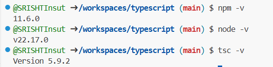

# typescript
for sih project (Sheriyans)
---
- type handling which is not there in javascript
1. Type script Setup
- setting up a typescript project
- configuring tsconfig.json
- compiling typescript

- koi bhi valid javascript code is valid typescript code hai
- if errors honge toh errors display toh honge but since the file is converted into typescript errors aayenge which means though file is compiled usmai errors hai.

- tsc filename //fir compile hojayega
- har baar changes karke if compile na karna ho to run the command as:
tsc --watch

//Basic Types
- Primitive types (number, string, boolean)
- Arrays
- Tuples
- Enums
- Any, Unknown, Void, Null, Undefined, Never

//Primitive and reference
- primitive mai kahi bhi bracket nahi aata
- reference mai brackets include hote hai

- primitive ko copy kar sakte ho directly
- reference ko directly copy nahi kar sakte 
- ek array mai if number and string both hai toh typescript infers it stating ki wo (string | number) ka array hai. javascript ye feature nahi deti hai
- let arr = [1, 2, 3, "abcd"]
- niiche wali declaration ne constraint laga diya that the type will be restricted to number only.
- let arr: number[] = [1, 2, 3, 4, "abcd"];
- tuple declaration:
let arr2: [number, string] = [12, "hari"];

- Enums
enum UserRoles{
    ADMIN = "admin",
    GUEST = "guest",
    SUPER_ADMIN = "super_admin"
}

enum StatusCodes {
    ABANDONED = "abandoned status code 500",
    NOTFOUND = "not found status code 404"
}

- let a; //iska type since defined nahi hai thus set to any

- hume make sure karna hai ki type any na ho nhai toh what's the role of type script really?

- type narrowing
let a = unknown;
a = 12;
a = "hari";

if(typeof a === "string")
    a.toUpperCase();

- aesa fntn jo kuch return nahi kar raha waha aapko colon lagakar batana padega konsa type hai-> 

function abcd(): void {
    console.log("hari");
}

function abcd(): number {
    return 12;
}

- null
let a: null;

- union
let a: string | null;
a = "hari";
a = null;

- never is wsed when some piece of code ki execution ke baad kuch bhi execute na ho (error handling and infinite codes mai zaroorat padti hai rest it's rarely of use)
function abcd(): never {
    while (true) {}
}
abcd();
console.log("hey");

